<!-- markdownlint-disable MD041 MD033 -->


# ADR-005: Type Lattices

[ADRs](./README.md)

## Status

✅ **Adopted**

> Principle is in use in the ecosystem, or the feature has been implemented in the example implementation

## Context

In mathematics, a [lattice](<https://en.wikipedia.org/wiki/Lattice_(order)>) is much like a set but it has a partial ordering and *join*ing lattices is slightly different from *union*ing sets.

Ada can specify types as ranges: `type Score is range 0 .. 1_000_000;`. A range is a lattice — subranges are sublattices.

Inheritance types define supersets (superclass) and subsets (subclass). A variable with a type of `Animal` can reference any object in the set of animals. A variable with the type `Dog` can only reference animals of the dogs subset.

### Definition

The term “[lattice](<https://en.wikipedia.org/wiki/Lattice_(order)>)” is a near-synonym to the word “set.” The main difference is that lattices have _partial ordering_. There is a top lattice that defines the world of possible values, and subsets/sublattices can be placed in order under it.



> [!info] **Image**
> 
> The `integer` lattice

The other difference is that two lattices can be _joined_, while two sets are _unioned_. The union of two sets creates a subset with all the existing elements **and no other**. A join of two lattices might add additional elements that the union does not include. It our case, we merge two integer ranges into one large range. If there is a gap between the ranges, the joined lattice includes that gap while the union would not.

$$[0, 10) \vee [15, 20) = [0, 20)$$

but:

$$[0, 10) \cup [15, 20] \not = [0, 20)$$

Here $\cup$ means the “union of sets,” and $\vee$ means “joined lattices.”

```
integer(0..<10) join integer(15..<20) == integer(0..<20)
integer(0..<10) union integer(15..<20) cannot be reduced
```

We are only interested in saying that the value is between 0 and 20, not that it cannon be in the subrange $[10, 15)$. That extra information creates implementation complexities but does not help anybody.

## Decision

Clawr declares variables, fields and parameters as having a lattice rather than just a simple type. Primitive types are unlimited lattices, while a variable declaration may add constraints such as ranges. The `integer` type represents the countably infinite set ℤ, and the `real` type represents the uncountable set ℝ. The `truthvalue` type represents the set containing the three truth-values `false`, `ambiguous` and `true`.

A complex type (`data`/`object`) represents the set of all possible structures of that type. Making `data` a lattice opens up for the possibility of defining sublattices by restricting field values.

Lattices `MAY` be used by backends to optimize storage.

### Lattice-valued Expressions

Expressions have `value` sets (sublattices) that differ depending on where in the code they appear. A value cannot be assigned to a variable if it does not belong to the variable’s declared lattice, but a variable whose lattice is too wide can still be examined and made eligible evidentially. The following code snippet illustrates how a reference to the same variable changes at different locations:

```clawr
mut x: integer(0..<10_000)

func assign_to_x(input: integer) {
  if (input < 10_000 && input >= 0) {
    x = input // known to be in [0, 10,000)
  } else {
    // x = input disallowed here

    // The input spans all of ℤ = (-inf, inf)
    // It must not be assigned to x
  }
}
```

## Rationale

- **Decoupling Meaning from Mechanism**: Traditional types often merge the conceptual range of a value with its binary representation. Lattices allow the language to describe the meaning of a value (e.g., "a score between 0 and 1M") without prescribing the solution (e.g., "a 32-bit unsigned integer").
- **Universal Applicability**: A type declaration in any programming language is, in effect, a lattice constraint—it defines a limited set of valid values.
- **Unified Hierarchy**: Inheritance classes in traditional OO languages are effectively subsets of their superclasses; lattices formalize this relationship.
- **Contextual Precision**: Lattices allow for more fine-grained, spatially dependent resolution of compatibility than static types allow.
- **Solve the Problem**: This approach decouples program semantics from low-level implementation details, allowing compilers and runtimes to optimize storage and operations without sacrificing correctness.
- **Separation of Concerns**: By focusing on the problem domain (relevant values) rather than the machine representation, implementation details can be deferred or refined independently. This grants backends the freedom to optimize for specific hardware without breaking the frontend's conceptual model.
- **Reduction of Cognitive Load**: Domain primitives are fundamentally constraints on valid values. Describingthese as lattices allows the developer to focus on the logic of the domain rather than the mechanics of thestorage.

### Design Philosophy: Problem vs. Solution

A core tenet of Clawr’s type system is to “solve the problem, don’t build a solution.”

By focusing on the problem domain (the set of relevant values) rather than the machine representation, the specific implementation can be deferred, refined, or replaced without altering the program's logic. When the frontend avoids prescribing implementation details, the backend is free to apply platform-specific optimizations.

Domain primitives are, at their heart, constraints on valid values. By abstracting these constraints into lattices, we remove the noise of implementation and reduce the cognitive load required to define domain logic.

## Alternatives Considered

- A simple, traditional type system

## Consequences

### Positive

- Clawr can spread to various platforms with different data storage formats.
- Compiler developers can perform different optimizations for different chipsets.
- New optimization ideas can be tested easily.

### Negative

- Tracking value sets for all expressions makes the frontend more complex.

## Related ADRs

- [ADR-000](./adr-000.md) (Platform Agnostic Language)

<script>MathJax = { tex: { inlineMath: [['$', '$']] } };</script>
<script id="MathJax-script" async
  src="https://cdn.jsdelivr.net/npm/mathjax@3/es5/tex-chtml.js">
</script>
