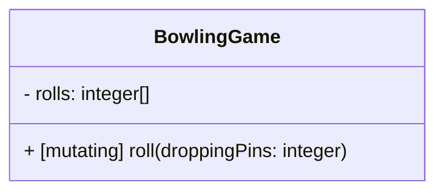
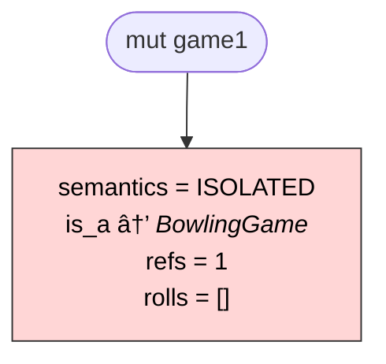
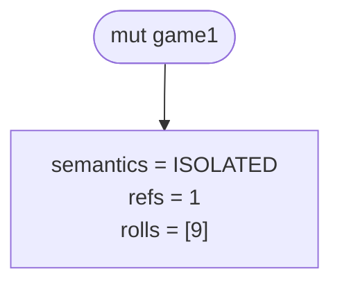
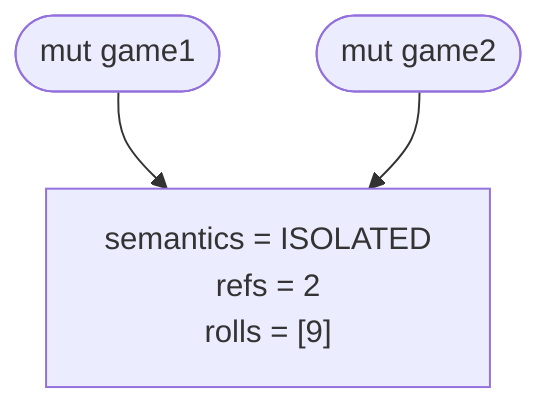
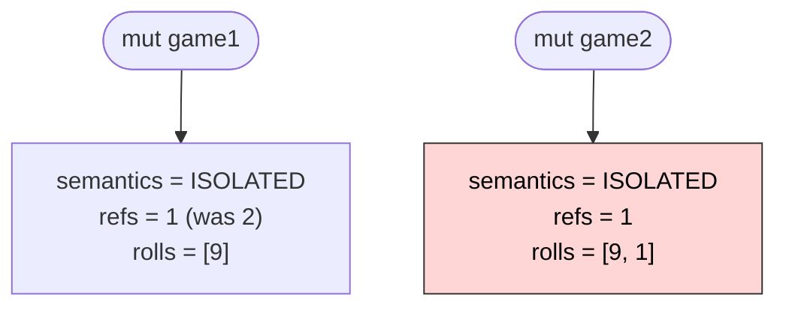
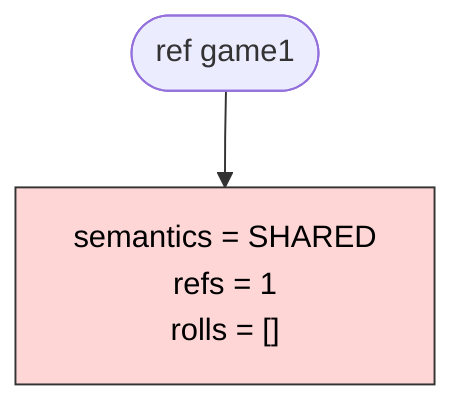
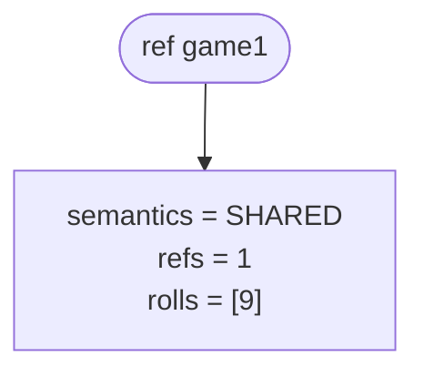
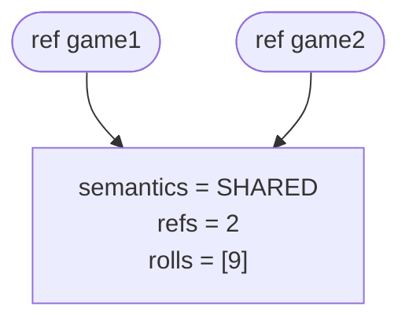
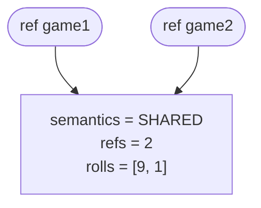

<!-- markdownlint-disable MD041 MD033 -->


# Variable Semantics Example

There are two kinds of memory structures in Clawr: `ISOLATED` and `SHARED`.

When a variable is declared as `const` or `mut`, the corresponding data structure will be flagged as the `ISOLATED` variety. This means that if there are multiple references to that structure when it is edited, the editing must be performed on a copy of the structure, not the structure itself. Only the variable that is explicitly edited may be modified. No other variables that reference the original structure may be changed. Local reasoning is a really powerful concept for understanding the state of your program. That is the contract when using `const` and `mut`.

When using `ref` or `mutref`, the contract says that the main subject is a `SHARED` entity somewhere in memory, not the variable itself. The variable is but one of potentially myriad pointers _referencing_ this entity. Modifying the entity from one location, will instantly be reflected to all other references. Using `ref`/`mutref` can improve performance — as no (implicit) copying is performed — but it invalidates local reasoning. And it also adds complexity in parallel execution contexts; you will need locking or other mechanisms to ensure that two processes cannot modify the same information at the same time.

| Keyword  | Semantic Kind | Contract                                  | Modifications                                                   |
| -------- | ------------- | ----------------------------------------- | --------------------------------------------------------------- |
| `const`  | `ISOLATED`    | Isolated (immutable) value contained      | Do not propagate to/from other variables                        |
| `mut`    | `ISOLATED`    | Isolated (mutable) value container        | Do not propagate to/from other variables                        |
| `ref`    | `SHARED`      | Reference to (fixed) shared entity        | Apply to referenced entity and affect all referencing variables |
| `mutref` | `SHARED`      | Reference to (reassignable) shared entity | Apply to referenced entity and affect all referencing variables |

To illustrate the difference between copy and reference semantics, let’s consider a Bowling game score calculator as an example. The actual code to calculate the score is irrelevant here, but we can assume that it needs to log how many pins were knocked down (or “dropped”) by each roll of the bowling ball. Let’s imagine an encapsulated `BowlingGame` `object` type that calculates the score for a single player:



## Copy Semantics

Let’s start playing a game using a `mut` variable, and then assign the game to a different variable that we’ll continue the game through. Because we’re using `mut` variables, this will create two isolated games.

```clawr
mut game1 = BowlingGame() // Creates a new `ISOLATED` memory structure
game1.roll(droppingPins: 9)
print(game1.score) // 9

mut game2 = game1 // Temporarily references the same memory block
game2.roll(droppingPins: 1) // Mutating game2 implicitly creates a copy where the change is applied
print(game1.score) // 9 - the game1 variable has not been changed by the last roll
print(game2.score) // 10 - game2 includes the score for the second roll
```

Let’s follow the state of the memory for each line of code in the example. First a `BowlingGame` object is instantiated and assigned to the `game1` variable. We can illustrate that as follows:

```clawr
mut game1 = BowlingGame()
```



The memory holds the state of the game as defined by the `BowlingGame` object type. It also holds some data defined implicitly by the Clawr compiler. These include a `semantics` flag, an `is_a` pointer that identifies the object's type, and a reference counter (`refs`).

The `is_a` pointer is irrelevant to memory management and will be elided in the other charts on this page. It identifies the type of the object and can be used for runtime type checking. The assigned type defines the layout of the memory block. It is also used for polymorphism (looking up which function to execute for a given method call).

The `semantics` flag identifies the memory structure as belonging to a `mut` variable and hence requiring isolation, the behaviour expressed in this exchange.

The `refs` counter starts at one at allocation and is incremented with every new variable assignment. When a variable is reassigned or descoped, the counter is decremented so that it always counts exactly how many references the structure has. When the counter reaches zero the memory is released to the system for other uses.

For a local variable in a function, reference counting might be redundant, as the memory will certainly be reclaimed when the function returns. But the structure can also be referenced by another structure, and will then have to be kept around for as long as that structure maintains _its_ reference.

The second line logs a roll of the bowling ball, which knocks down 9 pins. Because the `refs` counter is 1, this change is written directly into the memory without creating a copy.

```clawr
game1.roll(droppingPins: 9)
```



Then the new variable `game2` is assigned to the structure.

```clawr
mut game2 = game1
```



This increments the `refs` counter as there are now two variables referencing the same structure. As long as no modification is made to the structure, there is no need to maintain isolation. Both variables can reference the same memory block.

But then `game2` is modified though the `game2.roll(droppingPins: 1)` call, The method is tagged as `mutating`, which indicates that calling it will cause changes to the memory. As the `ISOLATED` flag indicates that memory changes must be done in isolation, a copy is made, and then the method is invoked _on that copy_.

```clawr
game2.roll(droppingPins: 1) // mutating method call
```



In the image, the red background signals a newly claimed block of memory. The other block is the original, unchanged one.

The new block will only be referenced by the changing variable (`game2`) and receives a `refs` counter of 1. Because `game2` has been reassigned, the old structure’s `refs` counter is decremented by one.

And this is how we can play two isolated bowling games even though we only explicitly created one.

## Reference Semantics

When a structure is instantiated and assigned to a `ref` variable, on the other hand, it will be flagged as `SHARED`. This means that multiple `ref` variables may reference the same (shared) structure and no implicit copying will be made.

Here is an example of usage:

```clawr
ref game1 = BowlingGame() // Creates a new `SHARED` memory structure
game.roll(droppingPins: 9)
print(game1.score) // 9

ref game2 = game // References the same structure
game2.roll(droppingPins: 1) // Mutation does not cause a copy
print(game1.score) // 10
```

Let’s follow the state of the memory for each line of code in the example. First a `BowlingGame` object is instantiated and assigned to the `game1` variable. We can illustrate that as follows:



The memory is structured exactly the same way as for a `ISOLATED` variable and the `is_a` (elided here) and `refs` properties have the same purposes. The only difference is the value of the `semantics` flag. In this case we use `SHARED` which has implications when we assign this block to multiple variables.

The second line logs a roll of the bowling ball, which knocks down 9 pins:



When the other variable is assigned:



And when the next roll is logged it updates the shared memory, affecting both variables:



This did not trigger a copy in this case. Because the variables are `ref` and the memory is flagged as `SHARED` the contract is different than that of `mut` variables.

A `mut` variable has to be isolated: it must not be changed by changing other variables, and no other variables may change when _it_ is changed. This is a powerful guarantee that makes local reasoning possible.

But the `ref` contract requires that a single entity can be referenced (and modified) from multiple locations. It must _not_ be copied (unless explicitly requested to) or the contract is broken.
